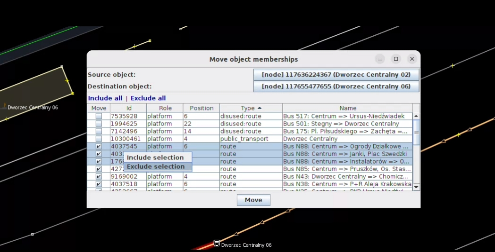

# MoveMembership plugin

## Description
Move an object memberships to another object with keeping order and roles in the relationships.

## Usage
Example case: You need to move `highway=platform` (as WAY) to `highway=bus_stop` (as NODE) and 
line platform is membership of many relations. Instead of manually clicking just
1. Open MoveMembership window from Menu->Selection.
2. Select source object
3. Select destination object
4. Click Move

You can also select 2 objects (order matters) before opening window, and it will be preselected in the window.

Another case: You might want to move some memberships from one bus stop to another, but you want to skip specific relations like `public_transport` or `disused:route`. You can easily filter them as below:

## License
[GPLv3](LICENSE)